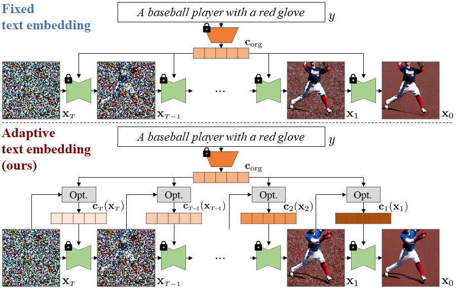

# Diffusion Adaptive Text Embedding for Text-to-Image Diffusion Models (DATE) (NeurIPS 2025)

| [paper](https://arxiv.org/abs/2510.23974) | [openreview](https://openreview.net/forum?id=cHi8QxGrZH) | [code](https://github.com/aailab-kaist/DATE) | [poster, slide, video](https://neurips.cc/virtual/2025/loc/san-diego/poster/117108) |

--------------------

This repository contains the official PyTorch implementation of **"Diffusion Adaptive Text Embedding for Text-to-Image Diffusion Models"** in **[NeurIPS 2025](https://neurips.cc/Conferences/2025)**.

**[Byeonghu Na](https://sites.google.com/view/byeonghu-na), [Minsang Park](https://aai.kaist.ac.kr/bbs/board.php?bo_table=sub2_1&wr_id=17), [Gyuwon Sim](https://aai.kaist.ac.kr/bbs/board.php?bo_table=sub2_1&wr_id=27), [Donghyeok Shin](https://sdh0818.github.io/), [HeeSun Bae](https://sites.google.com/view/baeheesun), [Mina Kang](https://aai.kaist.ac.kr/bbs/board.php?bo_table=sub2_1&wr_id=25), [Se Jung Kwon](https://www.linkedin.com/in/sejung-kwon), [Wanmo Kang](https://sites.google.com/site/wanmokang), and [Il-Chul Moon](https://aai.kaist.ac.kr/bbs/board.php?bo_table=sub2_1&wr_id=3)**

**KAIST, NAVER Cloud, summary.ai**

--------------------

**Diffusion Adaptive Text Embedding (DATE)** is a test-time method that dynamically updates text embeddings during diffusion sampling process.



---

## Requirements

We utilized CUDA 11.4 and Python 3.8.

```
pip install -r requirements.txt
```


## Sampling with DATE

DATE performs gradient-based updates of text embeddings at selected diffusion timesteps.
The update frequency and magnitude are controlled at inference time.

* Text-conditioned evaluation function: CLIP score
```.python
python generate_date_clip.py \
--steps=50 --scheduler=DDIM --save_path=gen_images --bs=4 --w=8 --skip_freq=10 \
--num_upt_prompt=1 --lr_upt_prompt=0.5 --name=TEST
```

* Text-conditioned evaluation function: ImageReward
```.python
python generate_date_ir.py \
--steps=50 --scheduler=DDIM --save_path=gen_images --bs=4 --w=8 --skip_freq=10 \
--num_upt_prompt=1 --lr_upt_prompt=0.5 --name=TEST
```


### Key Arguments

- `--steps`: number of diffusion sampling steps
- `--scheduler`: diffusion sampler (e.g., DDIM)
- `--bs`: batch size
- `--w`: classifier-free guidance scale
- `--skip_freq`: frequency of text embedding updates
- `--num_upt_prompt`: number of gradient steps per update
- `--lr_upt_prompt`: update scale ($\rho$)

---


## Evaluation

* Zero-shot FID
  * Download `coco.npz` at [this link](https://www.dropbox.com/scl/fi/srrqj78mkm7idye9fpnaw/coco.npz?rlkey=o6exeybbe01a0rpe7sp21n8a0&dl=0).

```.python
python evaluation/fid.py <directory_of_generated_images> <path_of_coco_npz_file>
```


* CLIP score
```.python
python evaluation/clip_score.py --text_path=subset.csv --img_path=<directory_of_generated_images>
```

* ImageReward
```.python
python evaluation/image_reward.py --text_path=subset.csv --img_path=<directory_of_generated_images>
```


## Acknowledgements

This codebase builds upon and is inspired by:

- **Diffusers**: https://github.com/huggingface/diffusers

- **Restart**: https://github.com/Newbeeer/diffusion_restart_sampling

- **DG**: https://github.com/aailabkaist/DG

- **DiffRS**: https://github.com/aailabkaist/DiffRS

- **ImageReward**: https://github.com/THUDM/ImageReward

## Citation

```bibtex
@inproceedings{
na2025diffusion,
title={Diffusion Adaptive Text Embedding for Text-to-Image Diffusion Models},
author={Byeonghu Na and Minsang Park and Gyuwon Sim and Donghyeok Shin and HeeSun Bae and Mina Kang and Se Jung Kwon and Wanmo Kang and Il-chul Moon},
booktitle={The Thirty-ninth Annual Conference on Neural Information Processing Systems},
year={2025},
url={https://openreview.net/forum?id=cHi8QxGrZH}
}
```
